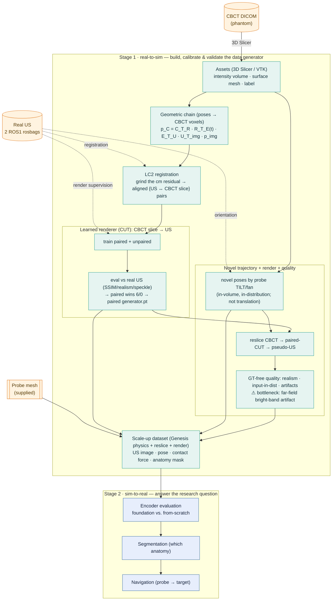

# DeepUSSim

**DeepUSSim** investigates whether a pretrained ultrasound *foundation-model encoder* is a
more robust visual representation for robotic ultrasound (US) than a model trained from
scratch. Answering this requires large, spatially aligned, labelled US data — prohibitively
expensive to acquire on hardware (the present study has only two real scan sequences).
DeepUSSim instead *calibrates a generator* — "CBCT volume + probe pose → US image + anatomy
mask" — from a small amount of real robot data, then samples probe poses freely in
simulation to synthesize aligned multimodal data at scale.

The system is organized in two stages. **Stage 1 (real-to-sim)** builds and calibrates the
generator: it fuses a CBCT volume of the phantom with two real robot-collected US sequences,
recovering both the *geometry* (which CBCT slice each US frame corresponds to) and the
*appearance* (how a CBCT slice should look as US). **Stage 2 (sim-to-real)** consumes the
generated data to evaluate encoders and to drive the downstream tasks (segmentation,
navigation). One-line compression: *CBCT supplies the anatomy ground truth; real US supplies
the modality constraint (geometry via LC2, appearance via a learned renderer); simulation
supplies the scale — which is then used to ask which representation transfers best.*

## Pipeline

Real US enters Stage 1 at three points — **geometric registration**, **render supervision**,
and **trajectory orientation** (generated poses borrow their orientation from the real EE poses,
since the probe presses straight down rather than along the surface normal) — and never elsewhere;
everything downstream is synthesized.



### Geometric backbone

Every US pixel is mapped to a physical position inside the CBCT volume by the rigid chain
(with `A_T_B` denoting "take a point from frame *B* into frame *A*"):

```
p_C  =  C_T_R · R_T_E(t) · E_T_U · U_T_img · p_img
```

| Segment | Meaning | Source / status |
|---|---|---|
| `U_T_img` | US intrinsics (pixel → fan mm) | convex fan **fitted** from the real B-mode + Feng's `us_spacing` (`calib.us_geometry.fit_fan_geometry`) |
| `E_T_U` | probe ↔ end-effector (hand-eye) | `Rz(45°)`, −0.183 m on z; mount = `T_EE_FROM_PROBE` (the measured matrix is its inverse, `T_PROBE_FROM_EE`), resolved by replay |
| `R_T_E(t)` | end-effector pose (forward kinematics) | per-frame, from the rosbag pose topic |
| `C_T_R` | CBCT ↔ robot | measured `PhTR` (robot↔phantom) **+ a belly-up lie-down** (`Rx90·Rz180`): `PhTR` lives in the CBCT scan frame `{c}`; the phantom is tipped *lying belly-up* and seated onto the contacts by `calib.seat_phantom_placement` |

The cm-scale residual that accumulates along this chain is not resliced directly; **LC2**
(Linear Correlation of Linear Combination) registers each real US frame to the CBCT by image
content, emitting the `{US ↔ slice}` pairs that supervise the renderer. LC2 fixes *pose*
(where); the renderer fixes *appearance* (how it looks) — the two are kept on separate axes
and never fused into one loss. On the present low-texture phantom LC2 reliably removes the
gross error and aligns the surface, but saturates before mm precision (see Status).

### Trajectory generation

We generate novel probe trajectories by **tilting/fanning the probe**, not by moving it to new
surface locations. The CBCT volume is small and the rosbag already swept most of the in-volume
surface, so any *translation* large enough to be novel pushes the fan out of the volume and renders
to black — **orientation is the axis with headroom**. The real probe presses **straight down** (its
axial varies <0.6° over a sweep) and does *not* follow the surface normal, so orientation is always a
bounded tilt off a **real EE pose**, never a mesh normal.

[`generate_tilt_trajectories.py`](renderer_training/generate_tilt_trajectories.py) takes the real
scan lines, rocks/fans the probe about its own lateral/elevation axes, and clips every pose to
`fraction_inside ≥ 0.9`. The result is novel **and** renderable **and** in-distribution at once: the
tilted beam cuts new anatomy (mean beam novelty **27°**, content novelty **0.55** = 1−NCC vs the
nearest real slice) while staying inside the volume (min **0.91**) and keeping the renderer's input
in-regime. Visualised by [`tilt_novelty.py`](plot_script/plots_reslice/tilt_novelty.py) (figures/4);
the rendered US and its GT-free quality are covered next.

The pose stream (`T_cbct_from_probe`, mm) drives **both** the reslice and — via
`calib.seat_phantom_placement` — the Genesis arm, so "where the probe is" and "which slice we image"
stay aligned by construction (this is what makes the anatomy masks free).

> **Legacy sim-arm trajectories** ([`pipeline/sampling.py`](src/deepussim/pipeline/sampling.py),
> `run_scaleup.py --trajectory`): `replay` (faithful arm path along the real EE poses, no new views)
> and `contact` / `surface-curves` (EE-oriented raster / curves over the surface). The mesh-normal
> samplers `surface_sweep` / `surface_raster` are **deprecated** — the real probe does not follow the
> normal ("non-watertight mesh" was a red herring).

### Renderer choice & generated-US quality

The renderer-data workflow lives in [`renderer_training/`](renderer_training/) plus the figure
scripts under [`plot_script/`](plot_script/); every figure is catalogued in
[`figures/README.md`](figures/README.md), numbered by pipeline stage (1–8). The novel poses it
renders come from the tilt generator above.

- **Paired vs unpaired renderer — paired wins.** Both CUT variants are trained from the LC2 pairs
  (`train_cut_{paired,unpaired}.py`); [`renderer_eval.py`](renderer_training/renderer_eval.py) scores
  them on the LC2-paired real frames (the only frames with per-frame ground truth) using fidelity
  (SSIM/PSNR/L1) **and** alignment-free realism (intensity-histogram + Nakagami-speckle Wasserstein,
  texture-Fréchet). **Paired wins 6/0** — including on the realism metrics that are unpaired's own
  objective, so it is not just memorising the L1. `render_us_from_poses.py` defaults to the paired
  `generator.pt`.
- **GT-free quality of the generated US.** Novel poses have no paired real US, so
  [`novel_render_eval.py`](renderer_training/novel_render_eval.py) evaluates without ground truth:
  (A) realism vs the real US *set* (texture-Fréchet **0.85×** the real-vs-real floor, speckle 1.4×),
  (B) **input in-distribution** — 98% of novel CBCT slices fall inside the training-CBCT manifold, so
  the *trajectory* is sound, and (D) artifact prevalence.
- ⚠️ **Current bottleneck — the renderer's far-field artifact.** ~30% of novel frames carry the paired
  renderer's deep-field bright-band artifact (a bright arc real US does not produce), which also skews
  the overall brightness distribution (histogram Wasserstein 3.7× floor). The trajectory is *not* the
  problem (input is 98% in-distribution). Fix: a far-field brightness regulariser / post-hoc
  suppression on the renderer, or cropping the deepest ~15% of the fan, then re-render. Tilt-specific
  *appearance* correctness still awaits real tilted US (see "Multi-angle data" in Status) — the GT-free
  metrics confirm realism and input-regime, not tilt-specific echo physics.

### Design invariants

- **Anatomy masks are free.** Reslicing the *label* volume at the same pose as the intensity
  volume yields per-frame segmentation ground truth — no manual labelling.
- **Force comes from physics, not the CBCT.** Contact force is produced by Genesis contact
  dynamics of the probe pressing on a *soft* (tissue-compliant) phantom and force-servoed to a
  realistic target (~few N, `UltrasoundScene.servo_to_force` + `SceneConfig.contact_timeconst`);
  the CBCT yields only image + mask. Reslicing is still rigid (no tissue deformation) — a known
  residual sim-to-real gap.
- **Mesh ≠ volume.** Genesis (a physics engine) consumes the *surface mesh* to make the
  probe glide on the phantom; reslicing consumes the *volume*. The CBCT DICOM yields three
  distinct products (volume, surface mesh, label) that must not be conflated.
- **Three models must not be conflated.** The synthesis/renderer (a Stage 1 tool), the visual
  encoder under evaluation (the research subject), and the control policy (downstream) are
  separate; conflating "is the synthesis good" with "is the representation good" voids the
  conclusion.
- **Dark frames are tagged, never dropped.** Lift-off / non-contact US frames are labelled
  `contact = 0` (negatives for the dataset, lift-off supervision for the renderer) rather than
  silently discarded.

> The probe mount (`T_EE_FROM_PROBE`) and the belly-up placement (`Rx90·Rz180`,
> `calib.seat_phantom_placement`) were both resolved by replay + in-tissue geometry, not LC2 — see
> [`scripts/verify_replay.py`](scripts/verify_replay.py) and the CHANGELOG (2026-06-04).

## Layout

```
src/deepussim/
  geometry.py        SE(3) transforms + quaternion helpers (geometric primitives)
  data/              volume IO (NIfTI / NRRD / DICOM), dataset records, rosbag extraction
  us/                reslice + physics US image-formation renderer (calibration params live here)
  renderer/          learned renderer (B1): CUT networks + losses + NeuralRenderer (CBCT→US)
  calib/             fan-geometry fit (us_geometry), LC2 registration (lc2), lie-down placement
                     (placement.seat_phantom_placement), rigid registration, renderer fitting,
                     measured ETU/PhTR transforms
  sim/               Genesis scene: FR3 + phantom, contact force, trajectory (lazy import)
  assets/franka_fr3/ vendored Franka Research 3 MJCF + meshes (MuJoCo Menagerie)
  pipeline/          pose sampling (contact_raster_ee, EE-oriented) + scale-up dataset generation
configs/             renderer / phantom / trajectory parameters
scripts/             run_scaleup.py, fit_us_geometry.py, extract_rosbags.py,
                     verify_replay.py, view_sim.py, gen_trajectory.py, smoke_sim.py,
                     prep_renderer_data.py, train_renderer.py, eval_renderer.py (learned renderer),
                     slurm/ (Alex GPU jobs: scaleup_sim, renderer_train, renderer_eval)
reslice/             clean CBCT->US reslicing package (build_frame, slice; replaces slicer_3.0)
lc2/                 LC2 pose refinement on top of reslice (per-frame + multi-frame; replaces run_lc2)
plot_script/         figure scripts (plot_sequence/dataset/renderer_*) + the LaTeX style system
docs/                data_collection.md (field checklist), renderer.md (B1 design), data_layout.md
tests/               geometry / reslice / renderer / neural_renderer / scaleup_gate / sampling / ...
```

Data files (CBCT, rosbags, derived NRRD/STL) are **not** in git — see
[`docs/data_layout.md`](docs/data_layout.md) for the `data/` tree and how to fetch it.

## Robot model

The sim uses the **Franka Research 3 (FR3)** — the real hardware — vendored from the
[MuJoCo Menagerie](https://github.com/google-deepmind/mujoco_menagerie) `franka_fr3`
model (Apache-2.0, license kept under `src/deepussim/assets/franka_fr3/`). Genesis only
bundles the older Panda; FR3 differs in joint limits, dynamics, and meshes. The FR3
model has no gripper — it ends at the `fr3_link7` flange with an attachment site 0.107 m
out, where the US probe mesh mounts. IK drives `fr3_link7`, but the rosbag/hand-eye are
measured from the *flange*, so `SceneConfig.probe_offset = trans(0,0,0.107) ∘ T_EE_FROM_PROBE`
(link7→flange→transducer); the bare flange offset misses real poses by ~15 cm, the composed
one reaches them to ~7 mm.

## Setup

Genesis (`genesis-world`) supports **Python 3.10–3.12** (not 3.13). Use a conda env:

```bash
conda create -n deepussim python=3.11 -y
conda activate deepussim
pip install -e ".[dev]"
# Genesis does NOT bundle torch — install it explicitly. On Linux the default wheel
# is the CUDA build (verified: torch 2.12.0+cu130 on an RTX 4060):
pip install torch
# pin the resolved Genesis version afterwards:
pip freeze | grep genesis-world
```

Verify the sim end-to-end (needs a GPU; ~60s to compile kernels on first run):

```bash
python scripts/smoke_sim.py   # Franka presses the phantom; prints contact force + pose
```

The geometric core (`geometry`, `us.reslice`, `us.renderer`, `calib.registration`)
only needs numpy/scipy and runs without Genesis installed. The `sim` package imports
Genesis lazily, so the rest of the package is importable without it.

### HPC / Apptainer (NHR@FAU)

For reproducible GPU/sim runs on the cluster (Alex/Helma), the brittle
`genesis-world` + `torch` + CUDA stack is containerized in [`apptainer/`](apptainer/).
Build on a frontend, then run with the GPU:

```bash
export WORK=/path/to/your/work
bash apptainer/build.sh                                   # → $WORK/deepussim.sif
apptainer/run.sh python scripts/smoke_sim.py             # --nv + live src bind
```

The conda env above is still fine for the CPU-only core. See
[`apptainer/README.md`](apptainer/README.md) for build/run details and the
one CUDA/driver caveat (container CUDA must match Alex's host driver).

### SLURM pipeline (Alex)

Batch GPU jobs live in [`scripts/slurm/`](scripts/slurm/) (named
`<stage-or-component>_<task>.slurm`; see [`scripts/slurm/README.md`](scripts/slurm/README.md)).
Each runs inside the Apptainer image and is submitted from the repo root:

```bash
sbatch scripts/slurm/scaleup_sim.slurm                   # Stage 1: sim scale-up dataset
```

| Job | Stage | Produces | Override (env) |
|---|---|---|---|
| `scaleup_sim.slurm` | 1 · scale-up | (US image, pose, anatomy mask, **contact force**) per reached+contacting pose; `RENDERER_CKPT=…` renders realistic US | `TRAJ`, `N`, `FORCE_N`, `RENDERER_CKPT`, `OUT` |
| `renderer_train.slurm` | 1 · B1 | learned CUT renderer → `generator.pt` (realistic US); `RESUME=…` to fine-tune | `EPOCHS`, `BATCH`, `DATA`, `RESUME`, `OUT` |
| `renderer_eval.slurm` | 1 · B1 | structure / surface metrics (+ cached fakes for login-side FID) | `RUN`, `DATA`, `N` |

> `scaleup_sim.slurm` alone renders the **placeholder physics** US; pass `RENDERER_CKPT=` (a
> trained `generator.pt`) to write the **learned** US instead — force/mask/pose are identical.

The conda env / no-`--sim` path (`scripts/run_scaleup.py` without `--sim`) produces the
same dataset minus force on CPU — fine for a quick look without the cluster.

## Reproduce

All commands assume the conda env above is active. The data files (CBCT, rosbags, phantom
mesh) are **not** in git — see [`docs/data_layout.md`](docs/data_layout.md) for the `data/`
tree and how to fetch it. The tests and the synthetic quickstart need neither data nor a GPU.

```bash
pytest -q          # geometric core + pipeline unit tests (no data, no GPU)
```

### Quickstart — synthetic (no data, no GPU)

An aligned dataset from a generated phantom, exercising the whole reslice→render→mask path:

```bash
python scripts/make_synthetic_phantom.py --out data/phantom
python scripts/run_scaleup.py --volume data/phantom/intensity.nii.gz \
    --labels data/phantom/labels.nii.gz --out data/synth_ds --n 64
```

### Stage 1 end-to-end (real data)

Run the calibrated generator from the raw inputs, in order. Steps 1–3 and 5 are CPU-only;
step 4b (the sim force channel) needs a CUDA GPU. `us_spacing = 0.166112957` mm/px is Feng's
measured US pixel size.

**1 · Assets** — place `data/cbct_20260612/` (intensity + label NRRD, surface STL) and `data/rosbags/`
per [`docs/data_layout.md`](docs/data_layout.md). The volume/mesh/label are exported once from
the CBCT DICOM in 3D Slicer.

**2 · Extract the real US sequences** (pure Python, no ROS install) — pose-synced, dark-tagged:

```bash
python scripts/extract_rosbags.py data/rosbags/phantom.bag data/rosbags/phantom1.bag \
    --out data/sequences --preview 8
```

**3 · Fit the US fan geometry** (`U_T_img`) from the real B-mode + `us_spacing`; prints the
`configs/renderer.yaml` geometry block and an outline overlay:

```bash
python scripts/fit_us_geometry.py --seq data/sequences/phantom.npz data/sequences/phantom1.npz \
    --us-spacing 0.166112957 --overlay data/sequences/fan_fit.png
```

**4 · Generate the geometry/force channels** — reslice the CBCT along probe poses, render a
US-like image, and read anatomy masks free from the label volume.

  *4a · no-sim* (geometric poses, CPU) — EE-oriented raster over the scanned patch:

```bash
python scripts/run_scaleup.py --volume data/cbct_20260612/intensity.nrrd \
    --labels data/cbct_20260612/labels.nrrd --mesh data/cbct_20260612/phantom_surface.stl \
    --trajectory contact --config configs/renderer.yaml --out data/ds --n 64
```

  *4b · sim force channel* (GPU) — the FR3 follows the **real `replay`** trajectory onto the
  phantom (placed *belly-up* and seated on the contacts), force-servoing each pose to a realistic
  ~few-N contact, writing (US image + pose + anatomy mask + contact force):

```bash
python scripts/run_scaleup.py --volume data/cbct_20260612/intensity.nrrd \
    --labels data/cbct_20260612/labels.nrrd --mesh data/cbct_20260612/phantom_surface.stl \
    --config configs/renderer.yaml --out data/ds_sim --sim --headless --n 64
# drop --headless to watch live in the Genesis viewer; --force-n / --contact-timeconst tune the contact
```

  `--trajectory contact`/`surface-curves` drive a *generated* trajectory instead (EE-borrowed
  orientation; see Trajectory generation).

**5 · LC2 registration** (`{US ↔ CBCT slice}` pairs) — refine each real frame's calibration
pose against the CBCT by image content. Now the self-contained `lc2/` package on top of the
`reslice/` slicing: `--method per-frame` (one nudge per frame) or `global` (one robust shared
correction — recommended); reports LC2 and fan tissue-coverage so a gaming run is visible.

```bash
python -m lc2.run --method global --sequence data/sequences/scan1.npz --out data/lc2/scan1_global.npz
```

### Watch / verify the calibration

```bash
python scripts/view_sim.py        # interactive viewer: arm sweeping the lying phantom
python scripts/verify_replay.py   # geometric check of the probe-mount + placement calibration
python scripts/gen_trajectory.py --mesh data/cbct_20260612/phantom_surface.stl --trajectory raster \
    --out data/trajectories/raster.npz                                   # generate + save a trajectory
python -m plot_script.plots_reslice.trajectories --trajectory-file data/trajectories/raster.npz  # draw it
```

### Renderer-data workflow (renderer_training/) — train → eval → novel poses → render → quality

This is the learned-renderer sub-pipeline (CUT renderer + the novel-tilt trajectory data and its
quality checks). All scripts run inside the Apptainer image; prefix each with the runner. On the
cluster:

```bash
export DEEPUSSIM_SIF=$WORK/deepussim.sif          # built by apptainer/build.sh
RUN="apptainer/run.sh"                             # = apptainer run --nv + repo binds
# steps 3–7 are CPU-only (add --device cpu); step 2 (training) needs a GPU node (sbatch).
```

Steps (each writes into the numbered `figures/` folders and `data/`):

**1 · LC2 → renderer pairs.** Build the `{CBCT slice ↔ real US}` training set from the LC2 poses:

```bash
$RUN python renderer_training/pair_generation.py --out data/renderer_lc2_pairs   # → pairs.npz (150 frames)
```

**2 · Train both renderers** (GPU; submit as batch jobs). Paired adds a weak supervised L1
(`--lambda-pair`); unpaired is the CUT baseline:

```bash
EPOCHS=300 sbatch renderer_training/slurm/train_cut_paired.sh      # → runs/renderer_cut_paired_display_ep300_b2_lp005/generator.pt
EPOCHS=300 sbatch renderer_training/slurm/train_cut_unpaired.sh    # → runs/renderer_cut_unpaired_display_ep300_b2/generator.pt
# or directly:  $RUN python renderer_training/train_cut_paired.py --out runs/<name> --epochs 300 --batch 2 --lambda-pair 0.05
```

**3 · Pick the renderer (paired vs unpaired).** Scores both on the LC2-paired real frames; paired
wins 6/0:

```bash
$RUN python renderer_training/renderer_eval.py --device cpu
# → figures/6_renderer_eval_paired_vs_unpaired/renderer_eval_comparison.png
#   data/renderer_eval/renderer_eval_{summary.json,metrics.csv}
```

**4 · Generate novel trajectories by probe tilt** (novel + in-volume + in-distribution):

```bash
$RUN python renderer_training/generate_tilt_trajectories.py \
    --out data/trajectories/novel_tilt_valid.npz \
    --lat-tilts-deg -24 -16 -8 8 16 24 --elev-tilts-deg -12 0 12 \
    --per-line 16 --n-trajectories 16 --min-inside 0.9
$RUN python -m plot_script.plots_reslice.tilt_novelty            # → figures/4_novel_trajectory_tilt/
```

**5 · Render pseudo-US** from the novel poses with the paired renderer (slice CBCT → CUT):

```bash
$RUN python renderer_training/render_us_from_poses.py \
    --trajectory data/trajectories/novel_tilt_valid.npz \
    --checkpoint runs/renderer_cut_paired_display_ep300_b2_lp005/generator.pt \
    --out data/rendered_us/novel_tilt_paired --device cpu
$RUN python -m plot_script.plots_renderer.rendered_us_gallery    # → figures/7_rendered_us_from_novel_tilt/ (all 243 frames)
```

**6 · GT-free quality of the generated US** (realism vs real set, input-in-distribution, artifacts):

```bash
$RUN python renderer_training/novel_render_eval.py
# → figures/8_novel_render_quality/novel_render_quality.png
#   data/novel_render_eval/novel_render_summary.json
```

All resulting figures are catalogued in [`figures/README.md`](figures/README.md).

## Status

Stage 1 is **end-to-end and produces aligned (US image + pose + anatomy mask + contact force)
datasets**: geometry, calibration, EE-oriented trajectory, the sim loop, **and the learned
appearance renderer (B1)** are implemented and verified. What remains is mostly *data*:
collecting orientation-diverse real US to lift the renderer/trajectory out of the single
down-press regime.

**Implemented & verified.**
- **Geometric core** — SE(3) + quaternions, convex-fan reslice, first-pass acoustic renderer,
  rigid registration (numpy/scipy only, no GPU).
- **Sim** — `sim.scene` (FR3 presses the phantom on the GPU, Genesis 0.4.7); the real probe
  mesh is mounted on the flange (`probe_offset = trans(0,0,0.107) ∘ T_EE_FROM_PROBE`, IK reaches
  real poses to ~7 mm); `servo_to_force` holds a realistic ~few-N contact on a soft
  (`contact_timeconst`) surface (vs. the ~10²–10³ N of a rigid press).
- **Real-data ingestion** — the two ROS1 rosbags are extracted (pose-synced, dark-tagged) via
  `data.rosbag`; the real CBCT loads via `data.load_nrrd`; the measured hand-eye `E_T_U` and
  robot↔phantom `PhTR` live in `calib.transforms`.
- **Calibration resolved** — `verify_replay.py` fixed the probe mount + placement direction
  (contact frames ~1–3 cm on-surface, dark frames 13–21 cm off, both sequences); the CBCT
  scan-frame orientation is resolved to **belly-up** (`Rx90·Rz180`) and centralised in
  `calib.seat_phantom_placement` — validated in sim (14/14 real poses reachable from above, fan
  82% inside tissue).
- **US intrinsics** — the convex fan (`radius 52.5`, `fov 68.1°`, `depth 101.5 mm`) is fitted
  from the real B-mode + Feng's `us_spacing` (`calib.us_geometry`).
- **Scale-up loop** — `run_scaleup --sim` drives the arm along the trajectory, presses, bridges
  each achieved pose into the CBCT frame, and reslices to (US image + anatomy mask + contact
  force). A write gate keeps only poses that **reached their target and made contact** (contact
  alone is a false positive); off-anatomy / empty slices are dropped.
- **Learned renderer (B1) — paired chosen.** A pure-torch CUT generator (`renderer/`) maps CBCT
  slice → US, wrapped as `NeuralRenderer` so scale-up writes realistic US. Both paired and unpaired
  variants are trained from the LC2 pairs; `renderer_training/renderer_eval.py` scores them on the 150
  LC2-paired real frames and **paired wins 6/0** (fidelity + alignment-free realism), so
  `render_us_from_poses.py` defaults to the paired generator (`figures/6_*`).
- **Novel-trajectory data by tilt + GT-free quality.** `generate_tilt_trajectories.py` produces novel
  poses from probe *tilt* (mean beam novelty 27°, content novelty 0.55) that stay renderable
  (min in-volume 0.91) and in-distribution; `novel_render_eval.py` confirms the rendered pseudo-US is
  realistic (texture-Fréchet 0.85× the real-vs-real floor) and that **98% of novel CBCT inputs are
  inside the training manifold** (the trajectory is sound). Figures: `figures/{4,7,8}_*`.
- **LC2 registration** — image-based `lc2_similarity` + constrained 6-DoF `register_frame_lc2`,
  initialised from the seated placement. (Absolute LC2 stays low on this low-texture phantom — it
  is *not* a reliable arbiter; see the placement note above.)

**Pending (Stage 1).**
- **Renderer far-field artifact (current quality bottleneck)** — the paired CUT renderer produces a
  deep-field bright-band artifact in ~30% of novel frames (real US has none), which also skews the
  brightness distribution (histogram Wasserstein 3.7× the real-vs-real floor). It is a *renderer*
  property, not the trajectory (novel inputs are 98% in-distribution). Fix: far-field brightness
  regulariser / post-hoc suppression, or crop the deepest ~15% of the fan, then re-render and re-run
  `novel_render_eval.py`. See `figures/8_novel_render_quality/`.
- **Multi-angle data (the main remaining piece)** — the renderer and trajectory are validated only
  for the single down-press regime (the two sequences span <0.6° of orientation). Tilt-diverse real
  US (next collection: ±25° fan/rock + fiducials) → fine-tune (`--resume`) unlocks multi-angle
  scale-up. The pipeline is ready to consume it; see [`docs/data_collection.md`](docs/data_collection.md).
- **Strict renderer validation** — FID + structure/surface metrics exist, but a real
  structure-consistency stress test needs the geometric variety (and fiducials) the next collection
  provides; FID is only a relative yardstick on this Inception-on-US setup.
- **LC2 accuracy / placement** — LC2 removes the gross error but **saturates before mm precision
  on this low-texture phantom**, and the refinement is bound-limited (the placement still carries
  a ~cm offset, seated on the contact cloud rather than from fiducials). Tighten the seat (along
  the normal / per-frame) so LC2 polishes rather than hunts.
- **Contact-depth realism** — force magnitude is realistic, but on the soft contact the probe
  indents deeper than physical; mm-indent-at-target needs a deformable soft-body phantom or finer
  contact/servo tuning. Reslicing is still rigid (no tissue deformation).
- **CT scale to confirm** — `intensity.nrrd` reports 0.742822 mm isotropic vs Feng's `ct_spacing`
  0.810738 (~9% off, likely a resample on export); confirm before trusting the CBCT-side mm scale.

**Stage 2.** Encoder evaluation, segmentation, and navigation follow the proposal and begin
once Stage 1 produces data.
