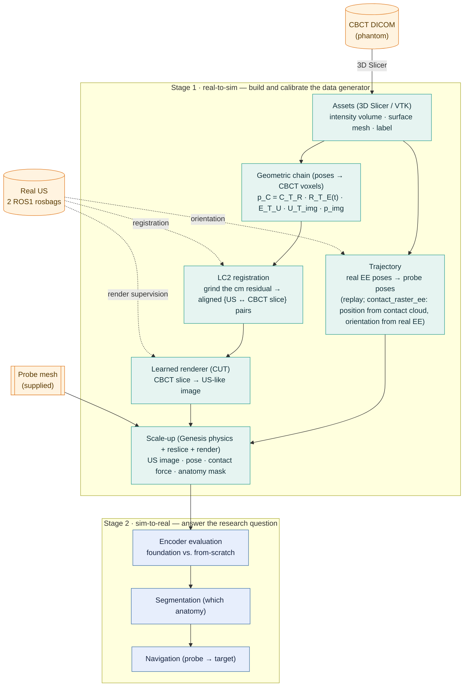

# DeepUSSim

**DeepUSSim** investigates whether a pretrained ultrasound *foundation-model encoder* is a
more robust visual representation for robotic ultrasound (US) than a model trained from
scratch. Answering this requires large, spatially aligned, labelled US data — prohibitively
expensive to acquire on hardware (the present study has only two real scan sequences).
DeepUSSim instead *calibrates a generator* — "CBCT volume + probe pose → US image + anatomy
mask" — from a small amount of real robot data, then samples probe poses freely in
simulation to synthesize aligned multimodal data at scale.

The system is organized in two stages. **Stage 1 (real-to-sim)** builds and calibrates the
generator: it fuses a CBCT volume of the phantom with two real robot-collected US sequences,
recovering both the *geometry* (which CBCT slice each US frame corresponds to) and the
*appearance* (how a CBCT slice should look as US). **Stage 2 (sim-to-real)** consumes the
generated data to evaluate encoders and to drive the downstream tasks (segmentation,
navigation). One-line compression: *CBCT supplies the anatomy ground truth; real US supplies
the modality constraint (geometry via LC2, appearance via a learned renderer); simulation
supplies the scale — which is then used to ask which representation transfers best.*

## Pipeline

Real US enters Stage 1 at three points — **geometric registration**, **render supervision**,
and **trajectory orientation** (generated poses borrow their orientation from the real EE poses,
since the probe presses straight down rather than along the surface normal) — and never elsewhere;
everything downstream is synthesized.



### Geometric backbone

Every US pixel is mapped to a physical position inside the CBCT volume by the rigid chain
(with `A_T_B` denoting "take a point from frame *B* into frame *A*"):

```
p_C  =  C_T_R · R_T_E(t) · E_T_U · U_T_img · p_img
```

| Segment | Meaning | Source / status |
|---|---|---|
| `U_T_img` | US intrinsics (pixel → fan mm) | convex fan **fitted** from the real B-mode + Feng's `us_spacing` (`calib.us_geometry.fit_fan_geometry`) |
| `E_T_U` | probe ↔ end-effector (hand-eye) | `Rz(45°)`, −0.183 m on z; mount = `T_EE_FROM_PROBE` (the measured matrix is its inverse, `T_PROBE_FROM_EE`), resolved by replay |
| `R_T_E(t)` | end-effector pose (forward kinematics) | per-frame, from the rosbag pose topic |
| `C_T_R` | CBCT ↔ robot | measured `PhTR` (robot↔phantom) **+ a belly-up lie-down** (`Rx90·Rz180`): `PhTR` lives in the CBCT scan frame `{c}`; the phantom is tipped *lying belly-up* and seated onto the contacts by `calib.seat_phantom_placement` |

The cm-scale residual that accumulates along this chain is not resliced directly; **LC2**
(Linear Correlation of Linear Combination) registers each real US frame to the CBCT by image
content, emitting the `{US ↔ slice}` pairs that supervise the renderer. LC2 fixes *pose*
(where); the renderer fixes *appearance* (how it looks) — the two are kept on separate axes
and never fused into one loss. On the present low-texture phantom LC2 reliably removes the
gross error and aligns the surface, but saturates before mm precision (see Status).

### Trajectory generation

The probe glides *along* the phantom surface, so a pose needs a surface **position** and an
**orientation**. The key finding: measured against the real poses, the probe presses **straight
down** (its axial varies <0.6° over a whole sweep) and does **not** follow the local surface
normal — so orientation is taken from the **real EE poses**, not from mesh normals. Two reliable
trajectories ([`pipeline/sampling.py`](src/deepussim/pipeline/sampling.py), the `--trajectory` flag
of [`run_scaleup.py`](scripts/run_scaleup.py)):

- **`replay`** — drive the arm along the real rosbag EE poses (subsampled). Reachable and
  on-surface by construction; the faithful reference, but it produces no new viewpoints.
- **`contact_raster_ee`** (`--trajectory contact`) — densify within the real scanned region:
  **position** from a serpentine raster over the real contact-point cloud's fitted plane,
  **orientation** borrowed from the nearest real EE pose. The surface mesh is used only to project
  each guide onto the surface and set the standoff — never for orientation.
- **`surface_curves_from_points`** (`--trajectory surface-curves`) — *leave* the scanned footprint:
  drape smooth curves through surface points anywhere on the phantom — including the lateral sides a
  real probe can't reach (sim's exclusive advantage) — still borrowing the real **down-press**
  orientation. This pushes the cheap **position** axis while staying in-regime on the expensive
  **orientation** axis (`contact_raster_ee` is bounded by `half_u/half_v` = the real footprint, so
  it scales up volume but not *coverage*). `side_anchor_curves` auto-seeds the curves; or pass your
  own hand-picked anchors. Each pose is tagged by `pose_surface_deviation` (**surface-turn** vs the
  patch, *not* axial-vs-normal — the real press is itself ~50° off the surface normal, so it scores
  the trusted real poses as Tier A by construction): **Tier A** (≤ `--tier-b-deg`, surface oriented
  like the patch → renderer-trusted) vs **Tier B** (lateral frontier → tag/quarantine, or drop with
  `--max-dev-deg`). Tier B is *also* the map of where the next real collection should go.

The resulting pose stream (`T_cbct_from_probe`, mm) is used **twice from one source** — fed
directly to reslice the volume, *and* mapped through the seated placement
(`calib.seat_phantom_placement`, the inverse of the reslice bridge) into the sim world to drive
the arm and press the Genesis probe into contact. Because the arm path and the reslice plane
come from the *same* poses, "where the probe is" and "which slice we image" are aligned by
construction — the same property that makes the anatomy masks free.

> ⚠️ **Two axes of "regime", not one.** *Orientation* (down-press ↔ tilted) was only supervised at
> the single down-press, so tilting is real extrapolation — **only new collection** extends it.
> *Position* (the scanned patch ↔ elsewhere on the surface) is the cheap axis: at the trusted
> orientation, new surface locations are a milder extrapolation, and the hard-to-reach ones are
> sim's **exclusive** advantage (real collection can't reach them either). `replay` /
> `contact_raster_ee` move on *neither* axis (they densify the footprint); `surface-curves` pushes
> *position* while holding *orientation* — its **Tier B** poses are where position has drifted far
> enough that the contact geometry no longer resembles training (validate before trusting). The
> mesh-normal samplers `surface_sweep` / `surface_raster` stay **deprecated** (they orient from mesh
> normals, which the real probe does not follow — the "non-watertight mesh" diagnosis was a **red
> herring**; the same unreliable normal sign is why Tier tagging measures surface-*turn*, not
> axial-vs-normal). Multi-angle coverage still needs orientation-diverse real US; then
> `contact_raster_ee` and `surface-curves` inherit the tilts automatically. See
> [`docs/data_collection.md`](docs/data_collection.md).

A generated trajectory is **deterministic** from (mesh + params), so it need not be stored — the
achieved poses are written into the dataset anyway; `--save-trajectory <path.npz>` optionally
dumps it (`T_cbct_from_probe`, mm) for inspection or to reuse the identical poses across runs.
Generation and plotting are split: [`scripts/gen_trajectory.py`](scripts/gen_trajectory.py)
generates a trajectory from the mesh (`raster` / `surface-curves` / `contact`) and saves it to a
`.npz`; [`plot_script/plots_reslice/trajectories.py`](plot_script/plots_reslice/trajectories.py)
draws it (`--trajectory-file`, 3D + top view, belly-up world frame) or overlays the recorded
sequences' coverage.

### Design invariants

- **Anatomy masks are free.** Reslicing the *label* volume at the same pose as the intensity
  volume yields per-frame segmentation ground truth — no manual labelling.
- **Force comes from physics, not the CBCT.** Contact force is produced by Genesis contact
  dynamics of the probe pressing on a *soft* (tissue-compliant) phantom and force-servoed to a
  realistic target (~few N, `UltrasoundScene.servo_to_force` + `SceneConfig.contact_timeconst`);
  the CBCT yields only image + mask. Reslicing is still rigid (no tissue deformation) — a known
  residual sim-to-real gap.
- **Mesh ≠ volume.** Genesis (a physics engine) consumes the *surface mesh* to make the
  probe glide on the phantom; reslicing consumes the *volume*. The CBCT DICOM yields three
  distinct products (volume, surface mesh, label) that must not be conflated.
- **Three models must not be conflated.** The synthesis/renderer (a Stage 1 tool), the visual
  encoder under evaluation (the research subject), and the control policy (downstream) are
  separate; conflating "is the synthesis good" with "is the representation good" voids the
  conclusion.
- **Dark frames are tagged, never dropped.** Lift-off / non-contact US frames are labelled
  `contact = 0` (negatives for the dataset, lift-off supervision for the renderer) rather than
  silently discarded.

> **Resolved by replay (probe mount + placement direction).** Driving the probe along the real
> rosbag poses and measuring its distance to the phantom surface picks the calibration
> unambiguously ([`scripts/verify_replay.py`](scripts/verify_replay.py)): the mount is
> `T_EE_FROM_PROBE` (the delivered hand-eye matrix `T_PROBE_FROM_EE` is its inverse), and the
> measured robot↔phantom matrix is used as CBCT→world (`T_WORLD_FROM_CBCT`). Under it, contact
> frames land ~1–3 cm from the surface while non-contact ("dark") frames sit 13–21 cm off
> (lift-off) — a two-sided check of the whole chain on both sequences.

> **Resolved: the CBCT-frame orientation (belly-up).** That matrix fixes the probe *position* but
> is expressed in the CBCT scan/optical frame `{c}`, rolled from the DICOM-LPS frame of our
> exported `intensity.nrrd` — applied raw it stands the phantom on end. The real rig has it
> *lying* **belly-up**: the probe presses straight down onto the up-facing anterior surface (the
> real EE axial is world `-z`) and images into the body. The lie-down that reproduces this is
> `Rx(90°)·Rz(180°)` about the phantom centre (`Rx` tips it off-end, `Rz` flips it belly-up),
> centralised in `calib.seat_phantom_placement`. Validated in sim: **14/14 real poses reachable
> pressing from above, fan 82% inside tissue**, vs the earlier belly-down `Rx(90°)` alone that
> imaged out of the body (~10%). **LC2 is not the arbiter here** — the low-texture body makes it
> *prefer* the wrong belly-down graze, so the physical prior + in-tissue geometry decide the
> orientation. (Superseded the belly-down placement of commit `2769501`; see CHANGELOG 2026-06-04.)

## Layout

```
src/deepussim/
  geometry.py        SE(3) transforms + quaternion helpers (geometric primitives)
  data/              volume IO (NIfTI / NRRD / DICOM), dataset records, rosbag extraction
  us/                reslice + physics US image-formation renderer (calibration params live here)
  renderer/          learned renderer (B1): CUT networks + losses + NeuralRenderer (CBCT→US)
  calib/             fan-geometry fit (us_geometry), LC2 registration (lc2), lie-down placement
                     (placement.seat_phantom_placement), rigid registration, renderer fitting,
                     measured ETU/PhTR transforms
  sim/               Genesis scene: FR3 + phantom, contact force, trajectory (lazy import)
  assets/franka_fr3/ vendored Franka Research 3 MJCF + meshes (MuJoCo Menagerie)
  pipeline/          pose sampling (contact_raster_ee, EE-oriented) + scale-up dataset generation
configs/             renderer / phantom / trajectory parameters
scripts/             run_scaleup.py, fit_us_geometry.py, extract_rosbags.py,
                     verify_replay.py, view_sim.py, gen_trajectory.py, smoke_sim.py,
                     prep_renderer_data.py, train_renderer.py, eval_renderer.py (learned renderer),
                     slurm/ (Alex GPU jobs: scaleup_sim, renderer_train, renderer_eval)
reslice/             clean CBCT->US reslicing package (build_frame, slice; replaces slicer_3.0)
lc2/                 LC2 pose refinement on top of reslice (per-frame + multi-frame; replaces run_lc2)
plot_script/         figure scripts (plot_sequence/dataset/renderer_*) + the LaTeX style system
docs/                data_collection.md (field checklist), renderer.md (B1 design), data_layout.md
tests/               geometry / reslice / renderer / neural_renderer / scaleup_gate / sampling / ...
```

Data files (CBCT, rosbags, derived NRRD/STL) are **not** in git — see
[`docs/data_layout.md`](docs/data_layout.md) for the `data/` tree and how to fetch it.

## Robot model

The sim uses the **Franka Research 3 (FR3)** — the real hardware — vendored from the
[MuJoCo Menagerie](https://github.com/google-deepmind/mujoco_menagerie) `franka_fr3`
model (Apache-2.0, license kept under `src/deepussim/assets/franka_fr3/`). Genesis only
bundles the older Panda; FR3 differs in joint limits, dynamics, and meshes. The FR3
model has no gripper — it ends at the `fr3_link7` flange with an attachment site 0.107 m
out, where the US probe mesh mounts. IK drives `fr3_link7`, but the rosbag/hand-eye are
measured from the *flange*, so `SceneConfig.probe_offset = trans(0,0,0.107) ∘ T_EE_FROM_PROBE`
(link7→flange→transducer); the bare flange offset misses real poses by ~15 cm, the composed
one reaches them to ~7 mm.

## Setup

Genesis (`genesis-world`) supports **Python 3.10–3.12** (not 3.13). Use a conda env:

```bash
conda create -n deepussim python=3.11 -y
conda activate deepussim
pip install -e ".[dev]"
# Genesis does NOT bundle torch — install it explicitly. On Linux the default wheel
# is the CUDA build (verified: torch 2.12.0+cu130 on an RTX 4060):
pip install torch
# pin the resolved Genesis version afterwards:
pip freeze | grep genesis-world
```

Verify the sim end-to-end (needs a GPU; ~60s to compile kernels on first run):

```bash
python scripts/smoke_sim.py   # Franka presses the phantom; prints contact force + pose
```

The geometric core (`geometry`, `us.reslice`, `us.renderer`, `calib.registration`)
only needs numpy/scipy and runs without Genesis installed. The `sim` package imports
Genesis lazily, so the rest of the package is importable without it.

### HPC / Apptainer (NHR@FAU)

For reproducible GPU/sim runs on the cluster (Alex/Helma), the brittle
`genesis-world` + `torch` + CUDA stack is containerized in [`apptainer/`](apptainer/).
Build on a frontend, then run with the GPU:

```bash
export WORK=/path/to/your/work
bash apptainer/build.sh                                   # → $WORK/deepussim.sif
apptainer/run.sh python scripts/smoke_sim.py             # --nv + live src bind
```

The conda env above is still fine for the CPU-only core. See
[`apptainer/README.md`](apptainer/README.md) for build/run details and the
one CUDA/driver caveat (container CUDA must match Alex's host driver).

### SLURM pipeline (Alex)

Batch GPU jobs live in [`scripts/slurm/`](scripts/slurm/) (named
`<stage-or-component>_<task>.slurm`; see [`scripts/slurm/README.md`](scripts/slurm/README.md)).
Each runs inside the Apptainer image and is submitted from the repo root:

```bash
sbatch scripts/slurm/scaleup_sim.slurm                   # Stage 1: sim scale-up dataset
```

| Job | Stage | Produces | Override (env) |
|---|---|---|---|
| `scaleup_sim.slurm` | 1 · scale-up | (US image, pose, anatomy mask, **contact force**) per reached+contacting pose; `RENDERER_CKPT=…` renders realistic US | `TRAJ`, `N`, `FORCE_N`, `RENDERER_CKPT`, `OUT` |
| `renderer_train.slurm` | 1 · B1 | learned CUT renderer → `generator.pt` (realistic US); `RESUME=…` to fine-tune | `EPOCHS`, `BATCH`, `DATA`, `RESUME`, `OUT` |
| `renderer_eval.slurm` | 1 · B1 | structure / surface metrics (+ cached fakes for login-side FID) | `RUN`, `DATA`, `N` |

> `scaleup_sim.slurm` alone renders the **placeholder physics** US; pass `RENDERER_CKPT=` (a
> trained `generator.pt`) to write the **learned** US instead — force/mask/pose are identical.

The conda env / no-`--sim` path (`scripts/run_scaleup.py` without `--sim`) produces the
same dataset minus force on CPU — fine for a quick look without the cluster.

## Reproduce

All commands assume the conda env above is active. The data files (CBCT, rosbags, phantom
mesh) are **not** in git — see [`docs/data_layout.md`](docs/data_layout.md) for the `data/`
tree and how to fetch it. The tests and the synthetic quickstart need neither data nor a GPU.

```bash
pytest -q          # geometric core + pipeline unit tests (no data, no GPU)
```

### Quickstart — synthetic (no data, no GPU)

An aligned dataset from a generated phantom, exercising the whole reslice→render→mask path:

```bash
python scripts/make_synthetic_phantom.py --out data/phantom
python scripts/run_scaleup.py --volume data/phantom/intensity.nii.gz \
    --labels data/phantom/labels.nii.gz --out data/synth_ds --n 64
```

### Stage 1 end-to-end (real data)

Run the calibrated generator from the raw inputs, in order. Steps 1–3 and 5 are CPU-only;
step 4b (the sim force channel) needs a CUDA GPU. `us_spacing = 0.166112957` mm/px is Feng's
measured US pixel size.

**1 · Assets** — place `data/cbct/` (intensity + label NRRD, surface STL) and `data/rosbags/`
per [`docs/data_layout.md`](docs/data_layout.md). The volume/mesh/label are exported once from
the CBCT DICOM in 3D Slicer.

**2 · Extract the real US sequences** (pure Python, no ROS install) — pose-synced, dark-tagged:

```bash
python scripts/extract_rosbags.py data/rosbags/phantom.bag data/rosbags/phantom1.bag \
    --out data/sequences --preview 8
```

**3 · Fit the US fan geometry** (`U_T_img`) from the real B-mode + `us_spacing`; prints the
`configs/renderer.yaml` geometry block and an outline overlay:

```bash
python scripts/fit_us_geometry.py --seq data/sequences/phantom.npz data/sequences/phantom1.npz \
    --us-spacing 0.166112957 --overlay data/sequences/fan_fit.png
```

**4 · Generate the geometry/force channels** — reslice the CBCT along probe poses, render a
US-like image, and read anatomy masks free from the label volume.

  *4a · no-sim* (geometric poses, CPU) — surface-constrained sweep over the phantom:

```bash
python scripts/run_scaleup.py --volume data/cbct/intensity.nrrd \
    --labels data/cbct/labels.nrrd --mesh data/cbct/phantom_surface.stl \
    --trajectory surface --config configs/renderer.yaml --out data/ds --n 64
```

  *4b · sim force channel* (GPU) — the FR3 follows the **real `replay`** trajectory onto the
  phantom (placed *belly-up* and seated on the contacts), force-servoing each pose to a realistic
  ~few-N contact, writing (US image + pose + anatomy mask + contact force):

```bash
python scripts/run_scaleup.py --volume data/cbct/intensity.nrrd \
    --labels data/cbct/labels.nrrd --mesh data/cbct/phantom_surface.stl \
    --config configs/renderer.yaml --out data/ds_sim --sim --headless --n 64
# drop --headless to watch live in the Genesis viewer; --force-n / --contact-timeconst tune the contact
```

  `--trajectory raster`/`surface`/`contact` drive a *generated* trajectory instead, but on this
  phantom they mis-orient (the mesh is not watertight — see the Trajectory-generation note); use
  `replay` until that is fixed.
```

**5 · LC2 registration** (`{US ↔ CBCT slice}` pairs) — refine each real frame's calibration
pose against the CBCT by image content. Now the self-contained `lc2/` package on top of the
`reslice/` slicing: `--method per-frame` (one nudge per frame) or `global` (one robust shared
correction — recommended); reports LC2 and fan tissue-coverage so a gaming run is visible.

```bash
python -m lc2.run --method global --sequence data/sequences/scan1.npz --out data/lc2/scan1_global.npz
```

### Watch / verify the calibration

```bash
python scripts/view_sim.py        # interactive viewer: arm sweeping the lying phantom
python scripts/verify_replay.py   # geometric check of the probe-mount + placement calibration
python scripts/gen_trajectory.py --mesh data/cbct/phantom_surface.stl --trajectory raster \
    --out data/trajectories/raster.npz                                   # generate + save a trajectory
python -m plot_script.plots_reslice.trajectories --trajectory-file data/trajectories/raster.npz  # draw it
```

## Status

Stage 1 is **end-to-end and produces aligned (US image + pose + anatomy mask + contact force)
datasets**: geometry, calibration, EE-oriented trajectory, the sim loop, **and the learned
appearance renderer (B1)** are implemented and verified. What remains is mostly *data*:
collecting orientation-diverse real US to lift the renderer/trajectory out of the single
down-press regime.

**Implemented & verified.**
- **Geometric core** — SE(3) + quaternions, convex-fan reslice, first-pass acoustic renderer,
  rigid registration (numpy/scipy only, no GPU).
- **Sim** — `sim.scene` (FR3 presses the phantom on the GPU, Genesis 0.4.7); the real probe
  mesh is mounted on the flange (`probe_offset = trans(0,0,0.107) ∘ T_EE_FROM_PROBE`, IK reaches
  real poses to ~7 mm); `servo_to_force` holds a realistic ~few-N contact on a soft
  (`contact_timeconst`) surface (vs. the ~10²–10³ N of a rigid press).
- **Real-data ingestion** — the two ROS1 rosbags are extracted (pose-synced, dark-tagged) via
  `data.rosbag`; the real CBCT loads via `data.load_nrrd`; the measured hand-eye `E_T_U` and
  robot↔phantom `PhTR` live in `calib.transforms`.
- **Calibration resolved** — `verify_replay.py` fixed the probe mount + placement direction
  (contact frames ~1–3 cm on-surface, dark frames 13–21 cm off, both sequences); the CBCT
  scan-frame orientation is resolved to **belly-up** (`Rx90·Rz180`) and centralised in
  `calib.seat_phantom_placement` — validated in sim (14/14 real poses reachable from above, fan
  82% inside tissue).
- **US intrinsics** — the convex fan (`radius 52.5`, `fov 68.1°`, `depth 101.5 mm`) is fitted
  from the real B-mode + Feng's `us_spacing` (`calib.us_geometry`).
- **Scale-up loop** — `run_scaleup --sim` drives the arm along the trajectory, presses, bridges
  each achieved pose into the CBCT frame, and reslices to (US image + anatomy mask + contact
  force). A write gate keeps only poses that **reached their target and made contact** (contact
  alone is a false positive); off-anatomy / empty slices are dropped.
- **Trajectory orientation** — generated poses take their orientation from the **real EE poses**
  (`contact_raster_ee`), not the mesh normals. Measured against the real poses, the probe presses
  straight **down** (axial spread <0.6°) and does *not* follow the surface normal, so mesh-normal
  orientation was wrong and watertightness a red herring; `contact`/`replay` are the reliable
  trajectories.
- **Learned renderer (B1)** — a CUT generator (`renderer/`, pure-torch) maps CBCT slice → US,
  trained against real US with an adversarial + PatchNCE (unpaired) objective, and wrapped as
  `NeuralRenderer` so `generate_dataset(renderer=…)` writes realistic US (the physics model stays
  as a baseline). Evaluated (`eval_renderer.py`): the surface is preserved to **~0.9 mm** (no
  hallucination of the main structure); FID is a relative yardstick (Inception-on-US).
  Pipeline: `scripts/{prep_renderer_data,train_renderer,eval_renderer}.py` +
  `scripts/slurm/renderer_{train,eval}.slurm`; fine-tune new data with `--resume`.
- **LC2 registration** — image-based `lc2_similarity` + constrained 6-DoF `register_frame_lc2`,
  initialised from the seated placement. (Absolute LC2 stays low on this low-texture phantom — it
  is *not* a reliable arbiter; see the placement note above.)

**Pending (Stage 1).**
- **Multi-angle data (the main remaining piece)** — the renderer and trajectory are validated only
  for the single down-press regime (the two sequences span <0.6° of orientation). Tilt-diverse real
  US (next collection: ±25° fan/rock + fiducials) → fine-tune (`--resume`) unlocks multi-angle
  scale-up. The pipeline is ready to consume it; see [`docs/data_collection.md`](docs/data_collection.md).
- **Strict renderer validation** — FID + structure/surface metrics exist, but a real
  structure-consistency stress test needs the geometric variety (and fiducials) the next collection
  provides; FID is only a relative yardstick on this Inception-on-US setup.
- **`surface_*` samplers** — `surface_sweep`/`surface_raster` still orient from mesh normals (a
  latent issue if used); `contact`/`replay` are the live, reliable paths.
- **LC2 accuracy / placement** — LC2 removes the gross error but **saturates before mm precision
  on this low-texture phantom**, and the refinement is bound-limited (the placement still carries
  a ~cm offset, seated on the contact cloud rather than from fiducials). Tighten the seat (along
  the normal / per-frame) so LC2 polishes rather than hunts.
- **Contact-depth realism** — force magnitude is realistic, but on the soft contact the probe
  indents deeper than physical; mm-indent-at-target needs a deformable soft-body phantom or finer
  contact/servo tuning. Reslicing is still rigid (no tissue deformation).
- **CT scale to confirm** — `intensity.nrrd` reports 0.742822 mm isotropic vs Feng's `ct_spacing`
  0.810738 (~9% off, likely a resample on export); confirm before trusting the CBCT-side mm scale.

**Stage 2.** Encoder evaluation, segmentation, and navigation follow the proposal and begin
once Stage 1 produces data.
