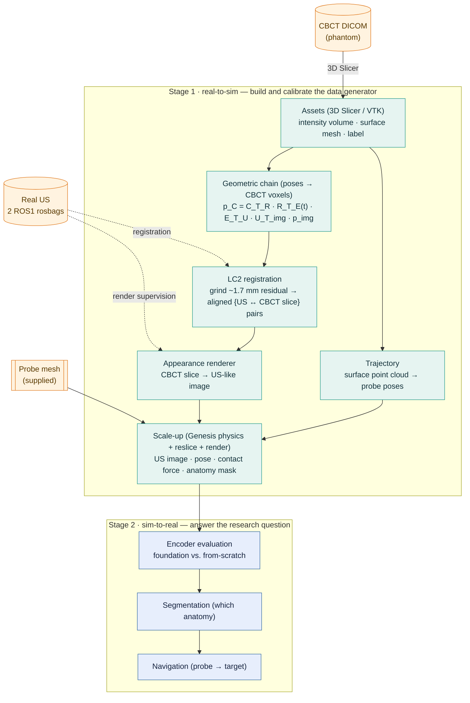

# DeepUSSim

**DeepUSSim** investigates whether a pretrained ultrasound *foundation-model encoder* is a
more robust visual representation for robotic ultrasound (US) than a model trained from
scratch. Answering this requires large, spatially aligned, labelled US data — prohibitively
expensive to acquire on hardware (the present study has only two real scan sequences).
DeepUSSim instead *calibrates a generator* — "CBCT volume + probe pose → US image + anatomy
mask" — from a small amount of real robot data, then samples probe poses freely in
simulation to synthesize aligned multimodal data at scale.

The system is organized in two stages. **Stage 1 (real-to-sim)** builds and calibrates the
generator: it fuses a CBCT volume of the phantom with two real robot-collected US sequences,
recovering both the *geometry* (which CBCT slice each US frame corresponds to) and the
*appearance* (how a CBCT slice should look as US). **Stage 2 (sim-to-real)** consumes the
generated data to evaluate encoders and to drive the downstream tasks (segmentation,
navigation). One-line compression: *CBCT supplies the anatomy ground truth; real US supplies
the modality constraint (geometry via LC2, appearance via a learned renderer); simulation
supplies the scale — which is then used to ask which representation transfers best.*

## Pipeline

Real US enters Stage 1 at exactly two points — **geometric registration** and **render
supervision** — and never elsewhere; everything downstream is synthesized.



### Geometric backbone

Every US pixel is mapped to a physical position inside the CBCT volume by the rigid chain
(with `A_T_B` denoting "take a point from frame *B* into frame *A*"):

```
p_C  =  C_T_R · R_T_E(t) · E_T_U · U_T_img · p_img
```

| Segment | Meaning | Source / status |
|---|---|---|
| `U_T_img` | US intrinsics (pixel → mm) | CBCT/US DICOM tag (read via SimpleITK/pydicom) |
| `E_T_U` | probe ↔ end-effector (hand-eye) | `Rz(45°)`, −0.183 m on z; mount = `T_EE_FROM_PROBE` (the measured matrix is its inverse, `T_PROBE_FROM_EE`), resolved by replay |
| `R_T_E(t)` | end-effector pose (forward kinematics) | per-frame, from the rosbag pose topic |
| `C_T_R` | CBCT ↔ robot | bridged as (phantom↔CBCT geometry) ∘ `PhTR` (robot↔phantom, measured) |

The ~1.7 mm residual that accumulates along this chain is not resliced directly; **LC2**
(Linear Correlation of Linear Combination) registers each real US frame to the CBCT by image
content, emitting the `{US ↔ slice}` pairs that supervise the renderer. LC2 fixes *pose*
(where); the renderer fixes *appearance* (how it looks) — the two are kept on separate axes
and never fused into one loss.

### Trajectory generation

The probe can only glide *along* the phantom surface (it cannot pierce it), so scan
trajectories are constrained to that surface. Each pose is built from the CBCT surface mesh:

1. **Sample** points across the surface — the candidate spots where the probe sits.
2. **Estimate a smoothed surface normal** at each point (local-neighbourhood / PCA fit, to
   avoid the staircase noise of the threshold-extracted mesh).
3. **Build a probe pose**: position on the surface (with a small outward standoff so the probe
   rests on it rather than inside), axial axis along the inward normal (perpendicular contact,
   as in SonoGym); the in-plane rotation is a free, consistent convention.
4. **Order** the points into a smooth scan path.

The resulting pose stream is then used twice from one source: mapped via `T_WORLD_FROM_CBCT`
to drive the arm (and press the Genesis probe into contact), and fed directly to reslice the
volume. Because the arm path and the reslice plane come from the *same* poses, "where the
probe is" and "which slice we image" are aligned by construction — the same property that
makes the anatomy masks free.

### Design invariants

- **Anatomy masks are free.** Reslicing the *label* volume at the same pose as the intensity
  volume yields per-frame segmentation ground truth — no manual labelling.
- **Force comes from physics, not the CBCT.** Contact force is produced by Genesis contact
  dynamics of the probe pressing on a *soft* (tissue-compliant) phantom and force-servoed to a
  realistic target (~few N, `UltrasoundScene.servo_to_force` + `SceneConfig.contact_timeconst`);
  the CBCT yields only image + mask. Reslicing is still rigid (no tissue deformation) — a known
  residual sim-to-real gap.
- **Mesh ≠ volume.** Genesis (a physics engine) consumes the *surface mesh* to make the
  probe glide on the phantom; reslicing consumes the *volume*. The CBCT DICOM yields three
  distinct products (volume, surface mesh, label) that must not be conflated.
- **Three models must not be conflated.** The synthesis/renderer (a Stage 1 tool), the visual
  encoder under evaluation (the research subject), and the control policy (downstream) are
  separate; conflating "is the synthesis good" with "is the representation good" voids the
  conclusion.
- **Dark frames are tagged, never dropped.** Lift-off / non-contact US frames are labelled
  `contact = 0` (negatives for the dataset, lift-off supervision for the renderer) rather than
  silently discarded.

> **Resolved by replay (probe mount + placement).** Driving the probe along the real rosbag
> poses and measuring its distance to the phantom surface picks the calibration unambiguously
> ([`scripts/verify_replay.py`](scripts/verify_replay.py)): the mount is `T_EE_FROM_PROBE`
> (the delivered hand-eye matrix `T_PROBE_FROM_EE` is its inverse), and the measured
> robot↔phantom matrix is applied directly as CBCT→world (`T_WORLD_FROM_CBCT`). Under the
> resolved calibration, contact frames land ~1–3 cm from the surface while non-contact
> ("dark") frames sit 13–21 cm off (lift-off) — a two-sided check of the whole chain on both
> sequences. The ~cm residual is what LC2 then grinds down.

## Layout

```
src/deepussim/
  geometry.py        SE(3) transforms + quaternion helpers (geometric primitives)
  data/              volume IO (NIfTI / NRRD / DICOM), dataset records, rosbag extraction
  us/                reslice + US image-formation renderer (calibration params live here)
  calib/             rigid registration, renderer fitting, sim->CBCT placement, measured ETU/PhTR transforms
  sim/               Genesis scene: FR3 + phantom, contact force, trajectory (lazy import)
  assets/franka_fr3/ vendored Franka Research 3 MJCF + meshes (MuJoCo Menagerie)
  pipeline/          pose sampling + scale-up dataset generation
configs/             renderer / phantom / trajectory parameters
scripts/             run_scaleup.py, extract_rosbags.py, verify_replay.py, run_real_collection.py, make_synthetic_phantom.py, smoke_sim.py, view_sim.py
docs/                data_collection.md (field checklist), data_layout.md (data/ tree + how to fetch)
tests/               geometry / quaternion / reslice / renderer / placement / rosbag / transforms unit tests
```

Data files (CBCT, rosbags, derived NRRD/STL) are **not** in git — see
[`docs/data_layout.md`](docs/data_layout.md) for the `data/` tree and how to fetch it.

## Robot model

The sim uses the **Franka Research 3 (FR3)** — the real hardware — vendored from the
[MuJoCo Menagerie](https://github.com/google-deepmind/mujoco_menagerie) `franka_fr3`
model (Apache-2.0, license kept under `src/deepussim/assets/franka_fr3/`). Genesis only
bundles the older Panda; FR3 differs in joint limits, dynamics, and meshes. The FR3
model has no gripper — it ends at the `fr3_link7` flange with an attachment site 0.107 m
out, where the US probe mesh mounts. IK drives `fr3_link7`, but the rosbag/hand-eye are
measured from the *flange*, so `SceneConfig.probe_offset = trans(0,0,0.107) ∘ T_EE_FROM_PROBE`
(link7→flange→transducer); the bare flange offset misses real poses by ~15 cm, the composed
one reaches them to ~7 mm.

## Setup

Genesis (`genesis-world`) supports **Python 3.10–3.12** (not 3.13). Use a conda env:

```bash
conda create -n deepussim python=3.11 -y
conda activate deepussim
pip install -e ".[dev]"
# Genesis does NOT bundle torch — install it explicitly. On Linux the default wheel
# is the CUDA build (verified: torch 2.12.0+cu130 on an RTX 4060):
pip install torch
# pin the resolved Genesis version afterwards:
pip freeze | grep genesis-world
```

Verify the sim end-to-end (needs a GPU; ~60s to compile kernels on first run):

```bash
python scripts/smoke_sim.py   # Franka presses the phantom; prints contact force + pose
```

The geometric core (`geometry`, `us.reslice`, `us.renderer`, `calib.registration`)
only needs numpy/scipy and runs without Genesis installed. The `sim` package imports
Genesis lazily, so the rest of the package is importable without it.

## Reproduce

All commands assume the conda env above is active. The data files (CBCT, rosbags, phantom
mesh) are **not** in git — see [`docs/data_layout.md`](docs/data_layout.md) for the `data/`
tree and how to fetch it. Steps 1 and the tests need neither data nor a GPU.

```bash
pytest -q          # geometric core + pipeline unit tests (no data, no GPU)
```

**1 — Synthetic (no data, no GPU)** — aligned dataset from a generated phantom:

```bash
python scripts/make_synthetic_phantom.py --out data/phantom
python scripts/run_scaleup.py --volume data/phantom/intensity.nii.gz \
    --labels data/phantom/labels.nii.gz --out data/synth_ds --n 64
```

**2 — Real CBCT, no sim** (needs `data/cbct/`) — reslice + render + free masks, no physics:

```bash
python scripts/run_scaleup.py --volume data/cbct/intensity.nrrd \
    --labels data/cbct/labels.nrrd --config configs/renderer.yaml --out data/ds --n 64
```

**3 — Sim force channel** (needs `data/cbct/` + `data/rosbags/` + a CUDA GPU) — the FR3
replays the real probe sweep onto the phantom (placed *lying* by the measured calibration),
force-servos each pose to a realistic contact on a soft tissue-like surface, and writes
(US image + pose + anatomy mask + contact force):

```bash
python scripts/run_scaleup.py --volume data/cbct/intensity.nrrd \
    --labels data/cbct/labels.nrrd --mesh data/cbct/phantom_surface.stl \
    --config configs/renderer.yaml --out data/ds_sim --sim --headless --n 64
# drop --headless to watch it live; --force-n (target N) and --contact-timeconst (softness) tune the contact
```

**4 — Watch / verify the calibration:**

```bash
python scripts/view_sim.py        # interactive viewer: arm sweeping the lying phantom
python scripts/verify_replay.py   # geometric check of the probe-mount + placement calibration
```

## Status

**Implemented & verified.** Geometric core (SE(3) + quaternions, reslice, first-pass
acoustic renderer, rigid registration); `sim.scene` (FR3 presses a phantom on the GPU,
Genesis 0.4.7) and the **closed no-real-data loop** — `run_scaleup --sim` drives the arm,
presses, bridges each achieved pose into the CBCT frame (`calib.placement`), and reslices to
(US image + anatomy mask + contact force). Real-data ingestion now lands: the two ROS1
rosbags are extracted (pose-synced, dark-tagged) via `data.rosbag`; the measured hand-eye
`E_T_U` and robot↔phantom `PhTR` are captured in `calib.transforms`; the real CBCT loads via
`data.load_nrrd` and reslice + render is verified on it.

```bash
# real CBCT -> US-like dataset (no sim): reslice + render + free masks from the label volume
python scripts/run_scaleup.py --volume data/cbct/intensity.nrrd \
    --labels data/cbct/labels.nrrd --config configs/renderer.yaml --out data/ds --n 64
# extract the real sequences (pure Python, no ROS install)
python scripts/extract_rosbags.py data/rosbags/phantom.bag data/rosbags/phantom1.bag \
    --out data/sequences --preview 8
```

Replay verification is now also done: `scripts/verify_replay.py` resolved the probe mount
(`T_EE_FROM_PROBE`) and the CBCT→world placement geometrically (contact frames ~1–3 cm
on-surface, dark frames 13–21 cm off), validating the transform chain on both real sequences.

The **real-data sim loop** now closes too (`run_scaleup --sim`, step 3 above): the real probe
mesh is mounted on the flange (`probe_offset = trans(0,0,0.107) ∘ T_EE_FROM_PROBE`, IK reaches
real poses to ~7 mm); the phantom is placed *lying* (`T_WORLD_FROM_CBCT ∘ Rx(90°)`, matching
the rig and `scripts/view_sim.py`) and seated onto the real contact cloud; and the arm replays
the real sweep, force-servoing each pose to a realistic ~few-N contact on a soft
(`contact_timeconst`) surface — yielding non-blank US images, anatomy masks, and plausible
forces (vs. the ~10²–10³ N of a rigid press).

**Pending (Stage 1).**
- **LC2 registration** — grind the residual into `{US ↔ slice}` pairs (current
  `calib.registration` is point-based, not image-based LC2).
- **Learned renderer** — only renderer-parameter fitting exists; train an image-translation
  renderer (pix2pix paired on LC2 pairs / CycleGAN unpaired at scale).
- **Contact-depth realism** — force magnitude is realistic, but on the soft contact the probe
  indents deeper than physical; mm-indent-at-target needs a deformable soft-body phantom or
  finer contact/servo tuning. Placement also still carries a ~cm residual (seated onto the
  contact cloud, not from fiducials).

**Stage 2.** Encoder evaluation, segmentation, and navigation follow the proposal and begin
once Stage 1 produces data.
